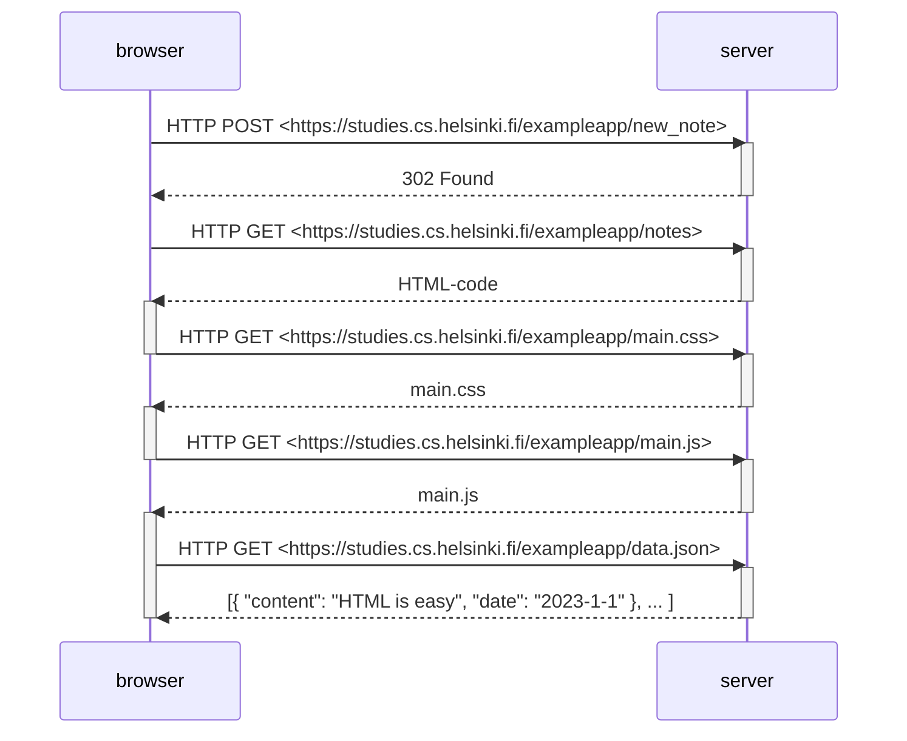

```mermaid
sequenceDiagram
participant browser
participant server

    browser->>server: HTTP POST <https://studies.cs.helsinki.fi/exampleapp/new_note>
    activate server
    server-->>browser: 302 Found
    deactivate server

    browser->>server: HTTP GET <https://studies.cs.helsinki.fi/exampleapp/notes>
    	activate server
    	server-->>browser: HTML-code
    	deactivate server
    activate browser
    	browser->>server: HTTP GET <https://studies.cs.helsinki.fi/exampleapp/main.css>
    	deactivate browser
    	activate server
    	server-->>browser: main.css
    	deactivate server
    	activate browser
    	browser->>server: HTTP GET <https://studies.cs.helsinki.fi/exampleapp/main.js>
    	deactivate browser
    	activate server
    	server-->>browser: main.js
    	deactivate server
    	activate browser
    browser->>server: HTTP GET <https://studies.cs.helsinki.fi/exampleapp/data.json>
    activate server
    server-->>browser: [{ "content": "HTML is easy", "date": "2023-1-1" }, ... ]
    deactivate server
    deactivate browser
```
